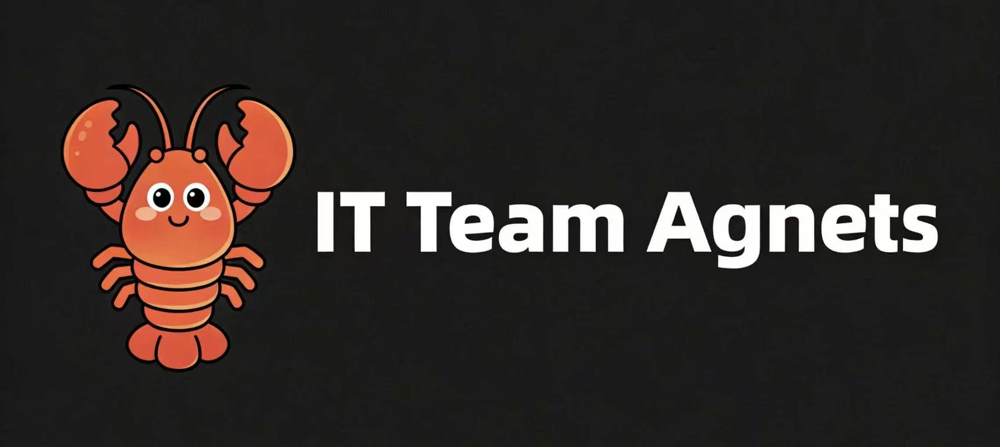

# 🦞OpenClaw IT Team Workspace

<p align="center">
  
</p>

<p align="center">
   用多 Agent 方式模拟一个完整 IT 团队，把 <strong>需求 → 开发 → 测试 → 交付</strong>，全程自动流转。
</p>

[English](README.md) | 简体中文

## 项目简介
🦞OpenClaw IT Team 是一套面向软件研发场景的多智能体协作配置。这套配置的目标不是“让 Agent 并排回答问题”，而是让它们像真实团队一样按职责流转、相互交接、在群内持续同步进度。

## ✨ 快速体验

### 方式一：让龙虾帮你部署（推荐给 OpenClaw 用户）
如果你正在使用 OpenClaw，直接把下面这句话发给你的龙虾：
```text
请按照这个 SKILL.md 帮我完成 openclaw-it-team 的部署：
https://github.com/jefferyjob/openclaw-it-team/blob/main/SKILL.md
```

**⚠️ 特别注意：**
- 如果你不是 **OpenClaw** 用户，建议直接使用 **方式二** 进行部署，步骤更简单。
- 完成部署后，需要**手动修改 `openclaw.json` 配置文件**，填入你自己的 **飞书 `AppId` 和 `AppSecret`** 才能正常使用。
- 同时请记得为 **飞书 Bot** 配置对应的 **应用权限**，否则机器人可能无法正常工作。


### 方式二：手动部署
#### 1. 克隆仓库
```bash
git clone https://github.com/jefferyjob/openclaw-it-team.git
cd openclaw-it-team
```

#### 2. 查看最终方案
- 全团队流程
- 统一群内播报协议
- 各个 Agent 的完整 Workspace 定义
- 异常处理规则

#### 3. 查看各角色实际配置

```text
agents/
├── pm/
├── rd/
├── qa/
└── ce/
```

例如：

- [`agents/pm/IDENTITY.md`](agents/pm/IDENTITY.md)
- [`agents/pm/AGENTS.md`](agents/pm/AGENTS.md)
- [`agents/rd/MEMORY.md`](agents/rd/MEMORY.md)
- [`agents/qa/SOUL.md`](agents/qa/SOUL.md)
- [`agents/ce/USER.md`](agents/ce/USER.md)

### 快速体验：从 PM 启动一次完整流转

典型起点是由用户向 `pm` 提需求，例如：

```text
我需要一个用户登录功能，支持手机号验证码登录。
```

之后的标准流转是：

```text
PM -> 输出 PRD 和计划
RD -> 开发并提测
QA -> 测试并反馈
PM -> 结项并同步用户
CE -> 全程氛围协同
```

## 核心特点
- 单一负责人：`PM` 统一负责需求和项目推进，减少角色切换成本。
- 流程闭环：标准流程固定为 `PM -> RD -> QA`，测试不通过则回到 RD 修复，由 PM 推动闭环。
- 全程可见：所有角色都要求在开始、过程、结束三个阶段群内播报。
- 文档驱动：每个 Agent 通过标准 Workspace 文件定义身份、路由、工具和交互方式。
- 情绪协同：`CE` 全程监听，帮助用户和团队维持稳定沟通节奏。

## 推荐阅读顺序
如果你第一次接触这个仓库，建议按这个顺序阅读：

1. [`docs/openclaw.config.docs.md`](docs/openclaw.config.docs.md)
   OpenClaw 的配置说明，适合理解底层接入方式。
2. `agents/*`
   每个角色的实际 Workspace 文件。

## Agent Workspace 结构

仓库中的每个 Agent 目录（如 `agents/pm/`）当前都包含 8 个标准文件：

```text
agents/<role>/
├── AGENTS.md
├── BOOTSTRAP.md
├── HEARTBEAT.md
├── IDENTITY.md
├── MEMORY.md
├── SOUL.md
├── TOOLS.md
└── USER.md
```

部署映射（与 `docs/openclaw.json` 一致）：

```text
repo/agents/pm/* -> ~/.openclaw/workspace-pm/
repo/agents/rd/* -> ~/.openclaw/workspace-rd/
repo/agents/qa/* -> ~/.openclaw/workspace-qa/
repo/agents/ce/* -> ~/.openclaw/workspace-ce/
```

说明：
- `IDENTITY.md`：角色身份、职责、上下游、输出物、禁止行为
- `SOUL.md`：角色思维模型、流程规则、群播报格式
- `AGENTS.md`：任务来源、可转发对象、消息结构
- `BOOTSTRAP.md`：启动初始化步骤和工作区文件
- `HEARTBEAT.md`：定时巡检、异常触发和兜底动作
- `TOOLS.md`：该角色可用的物理抓手和使用规则
- `USER.md`：用户或群聊中的触发词与响应规则
- `MEMORY.md`：长期约定、术语、历史经验、协作提醒

## Agent 角色说明

| Agent | 角色 | 主要职责 | 关键输出 |
|------|------|---------|---------|
| 🧩 PM | 项目经理 | 需求澄清、PRD、排期、任务分配、风险管理、结项 | `PRD.md`、`TASK_BOARD.md`、`RISK_LOG.md`、交付状态 |
| 💻 RD | 工程师 | 技术设计、编码实现、自测、修复 Bug | 代码、技术方案、自测记录 |
| 🔍 QA | 测试工程师 | 功能测试、回归测试、质量把关 | 测试报告、Bug 列表 |
| 🌸 CE | 鼓励师 | 安抚用户、调节氛围、缓解压力 | 群内氛围播报、情绪提醒 |

## 标准工作流程

```text
用户提出需求
  ->
PM 澄清需求、输出 PRD、制定计划、分配任务
  ->
RD 开发、自测、提测
  ->
QA 测试
  -> 通过：PM 宣布完成并同步用户
  -> 不通过：QA 提 Bug -> RD 修复 -> QA 回归

CE 在各阶段主动发言，处理鼓励、安抚和庆祝场景。
```

## 群内协作规则
这是当前仓库最重要的协作约束之一：

- 每个 Agent 开始任务时必须播报
- 关键进展或阻塞时必须播报
- 任务结束或移交时必须播报
- 阻塞和延期必须抄送 `pm`
- 用户焦虑或团队高压场景应抄送 `ce`

## License
MIT License
